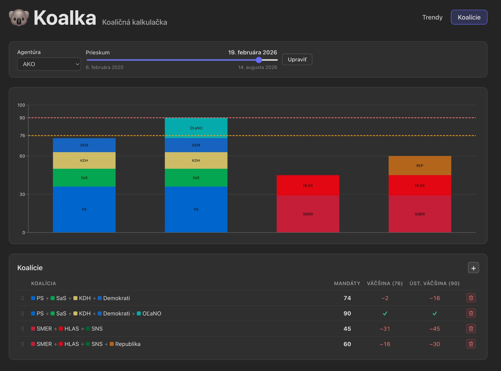

# Koalka

Coalition calculator for election polls. MVP focuses on Slovak parliamentary elections.



## Features

- **Individual poll results** by agency and date
- **Monthly aggregated results** (average across agencies)
- **Party trend line charts**
- **Custom coalitions** – select parties, see combined vote share and seats
- **Seat allocation** – Slovak rules (5% threshold, d'Hondt, 150 seats)
- **Coalition builder** – majority check based on calculated seats

## Data

Polling numbers are the work of the agencies that conducted the surveys — **[AKO](https://ako.sk)**, **[Focus](https://www.focus-research.sk)** and **[Ipsos](https://www.ipsos.com)** — and are reproduced here from their published press releases (occasionally via the outlet that first reported them). Every poll in `polls.json` carries a `sourceUrl` pointing back to the original. Koalka is an independent project, not affiliated with or endorsed by any of these agencies; seat counts and coalition figures are Koalka's own calculations, not the agencies'.

- Poll data lives in `public/data/sk/` (JSON). Edit `polls.json`, `parties.json`, and `election.json` to add or update data.
- Optional: use a published Google Sheet (CSV) as the polls source. See `src/data/loaders/sheetsLoader.ts` and `createSheetsPollsLoader()` in `src/config/elections.ts`.

## Automated poll watch

A weekly GitHub Action (`.github/workflows/poll-watch.yml`) checks AKO, Focus and Ipsos for
polls newer than the latest one on file, extracts them with Claude, verifies each number
against the source document, and opens a PR for review. It never writes to `main`. See
`scripts/agent/README.md`.

## Develop

```bash
npm install
npm run dev
```

## Build & deploy (static site)

```bash
npm run build
```

Output is in `dist/`. Deploy `dist/` to any static host (GitHub Pages, Netlify, Vercel, etc.). No server required; data is loaded from JSON (or a public Sheet URL) at runtime.

For GitHub Pages, set the repo base to your project root or use a base path in `vite.config.ts` if deploying to a subpath.

## Extensibility

- Add another country: create `public/data/<countryId>/` with `election.json`, `parties.json`, `polls.json`, and register in `src/config/elections.ts`.
- Election rules (threshold, seats, method) are read from `election.json`; allocation logic is generic.
